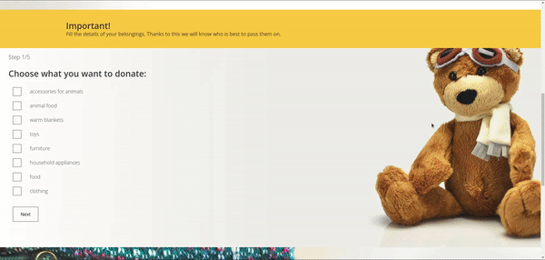

<div id="top"></div>


<br />
<div align="center">

<h3 align="center">Charity Donation App</h3>

  <p align="center">
    <br />
    <a href="#donation-demo">View Demo</a>
  </p>
</div>


<!-- TABLE OF CONTENTS -->
<details>
  <summary>Table of Contents</summary>
  <ol>
    <li>
      <a href="#about-the-project">About The Project</a>
      <ul>
        <li><a href="#built-with">Built With</a></li>
      </ul>
    </li>
    <li>
      <a href="#getting-started">Getting Started</a>
      <ul>
        <li><a href="#prerequisites">Prerequisites</a></li>
        <li><a href="#installation">Installation</a></li>
      </ul>
    </li>
    <li><a href="#donation-demo">Donation demo</a></li>
    <li><a href="#contact">Contact</a></li>
  </ol>
</details>


<!-- ABOUT THE PROJECT -->
## About The Project

The aim of the project is to create a place where everyone can donate unnecessary things to trusted institutions.

Here's why:
* People have a lot of unwanted items at their homes.
* There are many solutions available, but most of them require additional effort or are mistrusted. You have to go to the verified places, and there is no time / there is no way to go there. Containers in neighbourhoods or local collections are unverified and it is not known whether your items will actually go to those in need.  

Here comes this app with a solution, which will automate and speed up the donation process as well as make sure that all donated items will get to right and trusted hands.

### Key Functionalities
- Auth system
- Personal account
- Donation sending/managing system
- Email sending

## Donation demo



### Built With

* [Django](https://www.djangoproject.com/)

<!-- GETTING STARTED -->
## Getting Started

This is an example of how to make this project run locally.

### Prerequisites

* Upgrade pip to latest version
  ```sh
  python -m pip install --upgrade pip
  ```

### Installation
1. Clone the repo
   ```sh
   git clone https://github.com/ikolokotronis/charity-donation-app.git
   ```
2. Install pip packages
   ```python
   pip install -r requirements.txt
   ```
3. Enter your database settings in settings.py. Here is an example if you want to use PostgreSQL:
   ```python
   DATABASES = {
    'default': {
        'HOST': '127.0.0.1',
        'NAME': 'db_name_here',
        'ENGINE': 'django.db.backends.postgresql_psycopg2',
        'USER': 'user_name_here',
        'PASSWORD': 'password_here',
    }
    }
   ```
4. In order for the email sending functionality to work correctly, in settings.py go to line 137, 138 and fill the blank lines.
5. Switch to the main directory (cd charity_donation_app/) and run python manage.py runserver


<!-- CONTACT -->
## Contact

Ioannis Kolokotronis - ioanniskolokotronis1@gmail.com

Project Link: https://github.com/ikolokotronis/charity-donation-app

<!-- LICENSE -->
## License

Distributed under the MIT License. See `LICENSE.txt` for more information.

<p align="right">(<a href="#top">back to top</a>)</p>
